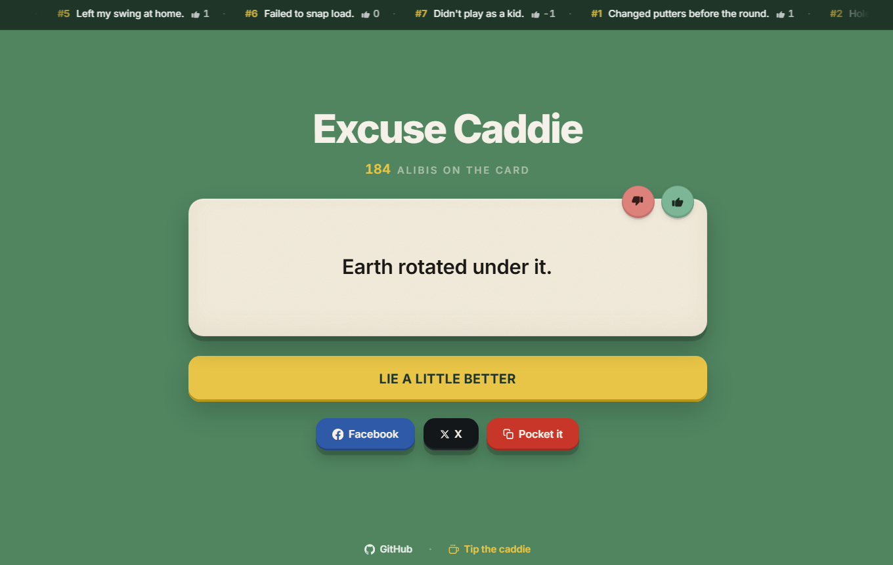

# Excuse Caddie

<p align="center">
  <strong>A quiet alibi service for the modern golfer.</strong><br />
  <a href="https://excusecaddie.xyz"><code>excusecaddie.xyz</code></a>
</p>

<p align="center">
  <a href="https://github.com/dotsystemsdevs/excuse-caddie/blob/main/LICENSE"></a>
  <a href="https://nextjs.org"></a>
  <a href="https://excusecaddie.xyz"></a>
  
</p>

<p align="center">
  
</p>

One tap. One ironclad excuse for the round you'd rather forget. Shanked drives, lipped-out putts, mysteriously missing balls — the Caddie has a story for it.

> _"Trees jumped out."_  
> _— Today's ruling, no. 1,247_

---

## What it is

A single-screen web app: 268 hand-curated golf excuses, weighted random pick, weekly leaderboard, splash sound effects, and one big "Take the Mulligan" button. No accounts, no tracking, no scroll.

Every excuse also lives at its own URL (`/1` through `/268`) with its own OG image and metadata, so a shared link actually shows the excuse you sent.

This repo previously hosted a React Native / Expo mobile app; it has been retired and rewritten as a Next.js website. The mobile-app history is preserved in earlier commits if you want to dig.

## Features

- **268 excuses** across 9 categories ([`lib/excuses.js`](lib/excuses.js)), weighted random — never repeats consecutively
- **Live counter** of excuses served (Upstash Redis `INCR`)
- **Weekly Top 3 banner** voted by the community
- **Thumbs up/down** per excuse, with toggle/switch (Redis HASH per device ID)
- **10 random golf sounds** on each click (real freesound.org clips, auto-detected from `/public/sounds/`)
- **Rotating CTA copy** — 20 different golf-bro labels after the first click
- **Share row** — Reddit, X, Facebook, native Web Share API on mobile (clipboard fallback elsewhere)
- **Per-excuse URLs** — `/253` deep-links to a specific ruling so it survives a tweet, DM, or Reddit post
- **Dynamic OG images** — every excuse gets its own 1200×630 social card rendered on demand
- **Sitemap & robots.txt** — all 269 URLs (home + 268 excuses) listed for indexing
- **Single-screen, no scroll** — fits any viewport, mobile through 4K

## Tech

| | |
|--|--|
| Framework | Next.js 15 (App Router, React 19) |
| Styling | Tailwind CSS v4 |
| Storage | Upstash Redis (sorted sets + hashes for leaderboards & dedup) |
| OG images | Next.js `ImageResponse` on the Edge runtime |
| Analytics | `@vercel/analytics` (custom events: `generate_excuse`, `vote_excuse`, `share_copy`, `share_open`) |
| Hosting | Vercel |
| Sounds | Web `Audio` API + freesound.org CC0 clips |

## Develop locally

```bash
git clone https://github.com/dotsystemsdevs/excuse-caddie.git
cd excuse-caddie
npm install
npm run dev
```

Open `http://localhost:3000`.

The site runs without Redis — counter shows 0 and leaderboard is empty until you add credentials. To wire up storage:

1. Create a free Upstash Redis at https://console.upstash.com/redis
2. Copy `.env.example` to `.env.local` and paste in `UPSTASH_REDIS_REST_URL` and `UPSTASH_REDIS_REST_TOKEN`
3. Restart `npm run dev`

```bash
npm run build   # production build
npm run start   # serve the built app
npm run lint
```

## Project layout

```
app/
  page.js                    The whole UI — wordmark, counter, excuse, CTA, share
  layout.js                  Metadata + JSON-LD + font loading (Inter via Google Fonts)
  globals.css                Tailwind theme + race-color palette + shadow scale
  opengraph-image.js         Home OG image (1200×630, edge runtime)
  twitter-image.js           Home Twitter card
  sitemap.js                 269 URLs (home + 268 excuses)
  robots.js                  Allow-all + sitemap reference
  [num]/
    page.js                  /1..268 — same UI, pre-picked excuse, per-page metadata
    opengraph-image.js       Per-excuse OG image with the actual quote
    twitter-image.js         Per-excuse Twitter card
  api/
    generated/route.js       GET total / POST INCR — global excuse counter
    vote/route.js            POST { excuseId, deviceId, direction } — toggle vote
    leaderboard/route.js     GET ?range=weekly|monthly|all — top excuses
    sounds/route.js          GET — auto-list of all mp3s in /public/sounds/
components/
  TopBanner.js               Weekly top 3 strip
  Footer.js                  GitHub + Tip the caddie
  CountUp.js                 Animated number counter
lib/
  excuses.js                 The 268 excuses
  utils.js                   pickWeighted, pickDifferentWeighted helpers
  excuse-ids.js              Deterministic hash → excuse text map
  og.js                      Shared OG-image renderer (Satori / ImageResponse)
  redis.js                   Upstash client + key helpers
  rate-limit.js              Per-IP rate limits on /api/* routes
  api.js                     Browser-side fetch wrappers
  sounds.js                  Random sound playback (auto-detected from public/sounds/)
public/
  sounds/                    Drop more .mp3 files here — they'll be picked up automatically
  logo-*.png                 Logos
docs/
  screenshot.png             Hero shot used in this README
```

## API

| Route | Method | Purpose |
|-------|--------|---------|
| `/api/generated` | `GET` | Read total excuses dispensed (Redis counter) |
| `/api/generated` | `POST` | Increment counter; returns new total |
| `/api/vote` | `POST` | Body: `{ excuseId, deviceId, direction: 'up' \| 'down' }` — toggle/switch vote |
| `/api/leaderboard` | `GET` | Query: `?range=weekly\|monthly\|all` — top 20 by net score |
| `/api/sounds` | `GET` | Auto-list of mp3s in `/public/sounds/` |

All API routes return `{ ..., persisted: boolean }` so the client knows whether Redis was reachable. Each route is rate-limited per IP — see [`lib/rate-limit.js`](lib/rate-limit.js).

## Acknowledgements

Sound effects from [freesound.org](https://freesound.org/) (CC0 / Community).

## Contributing

- Read [`CONTRIBUTING.md`](CONTRIBUTING.md)
- Add excuses via the "Add more excuses" issue template, or PR directly to [`lib/excuses.js`](lib/excuses.js)
- Found a security issue? See [`SECURITY.md`](SECURITY.md) — please don't open a public issue

## License

MIT — see [`LICENSE`](LICENSE).

Made by [Dot](https://github.com/dotsystemsdevs). Like it? [Tip the caddie](https://buymeacoffee.com/dotdevs).
