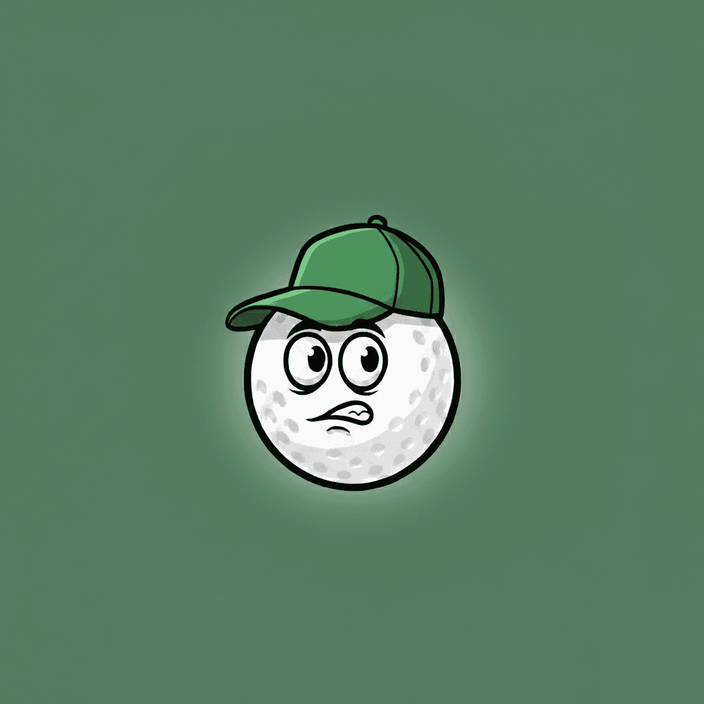

# app-golfexcuse

**Golf Excuse Generator** — mobilapp som ger slumpmässiga golfursäkter i en knapptryckning. Välj valfritt väder (Windy, Rain, Cold, Hot), tryck **Generate Excuse**, kopiera och dela. Ingen konto, ingen spårning. React Native (Expo).

**Version:** 1.0.0 · **Repo:** [dotsystemsdevs/app-golfexcuse](https://github.com/dotsystemsdevs/app-golfexcuse)



---

## Status — allt klart och omhändertaget

- **Kod:** Edge cases hanterade (tomma listor, ogiltig config, try/catch på async, Linking/Clipboard/Updates).
- **UI:** Inledande laddningsskärm, tillgänglighet (VoiceOver/TalkBack, reduce motion), tydliga etiketter.
- **Design:** All spacing/färger från `src/constants.js`; inga hårdkodade magiska tal i stilar.
- **Legal:** Privacy & Terms länkade; källkod i `legal/app-golfexcuse/`, publicera via app-legal-docs.
- **Store:** Texter i PLAYSTORE_LISTING.md; app.json har bundleIdentifier/package/versionCode; ROADMAP med build-checklista.
- **Underhåll:** En plats för config (`constants.js`), tydlig projektstruktur, inga oanvända dependencies.

---

## Snabbreferens

| Fil | Syfte |
|-----|--------|
| [ROADMAP.md](ROADMAP.md) | Versioner, released, build checklist, planerat |
| [PLAYSTORE_LISTING.md](PLAYSTORE_LISTING.md) | Texter att kopiera till Play Store & App Store |
| [app-legal-docs-app-golfexcuse/](app-legal-docs-app-golfexcuse/) | Privacy & Terms (kopiera till [app-legal-docs](https://github.com/dotsystemsdevs/app-legal-docs) under mappen `app-golfexcuse`) |

---

## Vad appen gör

- **Slumpmässig ursäkt** — ett tryck, 150+ alternativ
- **Väder (valfritt)** — Windy, Rain, Cold, Hot som prefix
- **Kopiera** — en tryckning, feedback "Copied!"
- **Betyg** — uppmaning efter 3 genereringar; länkar till Privacy & Terms i sidfoten
- **Uppdateringar** — in-app kontroll (Expo Updates)
- **Tillgänglighet** — VoiceOver / TalkBack, reduce motion
- **100 % offline** — ingen backend, all data lokalt

---

## Teknik

- React Native (Expo SDK 54)
- iOS & Android (portrait, safe area)
- Ingen backend

---

## Kom igång

**Krav:** Node.js (LTS), npm. För iOS: Xcode. För Android: Android Studio.

```bash
git clone https://github.com/dotsystemsdevs/app-golfexcuse.git
cd app-golfexcuse
npm install
npm run ios      # iOS-simulator
npm run android  # Android-emulator
```

### Scripts

| Kommando | Beskrivning |
|----------|-------------|
| `npm start` | Startar Expo dev-server |
| `npm run ios` | Kör på iOS |
| `npm run android` | Kör på Android |
| `npm run web` | Kör i webbläsare |

---

## Projektstruktur

```
app-golfexcuse/
├── App.js              # Huvudkomponent
├── index.js            # Entry (registerRootComponent)
├── app.json            # Expo (name, slug, version, ikoner, splash)
├── package.json
├── eas.json            # EAS Build-profiler (production m.m.)
├── README.md           # Denna fil
├── ROADMAP.md          # Versioner, checklista, planerat
├── PLAYSTORE_LISTING.md # Store-texter (kopiera till Console/Connect)
├── LICENSE             # MIT
├── src/
│   ├── constants.js    # CONFIG, PALETTE, SPACING, FONT — ändra här
│   ├── utils.js       # pickRandom (slump från array)
│   └── excuses.js     # Lista EXCUSES (150+)
├── assets/
│   ├── icon.png       # App-ikon
│   ├── logo.png       # Logo i appen
│   ├── splash-icon.png
│   ├── adaptive-icon.png
│   └── favicon.png
└── legal/
    └── app-golfexcuse/   # Privacy & Terms (publicera via app-legal-docs)
        ├── privacy.md
        ├── terms.md
        └── README.md
```

---

## Legal

Appen länkar till dessa sidor (måste finnas publicerade i app-legal-docs):

- **Privacy:** [Privacy Policy](https://dotsystemsdevs.github.io/app-legal-docs/app-golfexcuse/privacy.html)
- **Terms:** [Terms of Service](https://dotsystemsdevs.github.io/app-legal-docs/app-golfexcuse/terms.html)

Källkod för dokumenten ligger i `legal/app-golfexcuse/`. Publicera mappen under [app-legal-docs](https://github.com/dotsystemsdevs/app-legal-docs) som `app-golfexcuse/` så att URL:erna ovan fungerar.

---

## Licens & kontakt

- **Licens:** MIT — se [LICENSE](LICENSE).
- **GitHub Topics:** `react-native` · `expo` · `golf` · `mobile-app` · `ios` · `android` · `javascript` · `mit-license`
- **Kontakt:** Dot Systems — support@dotsystems.se
