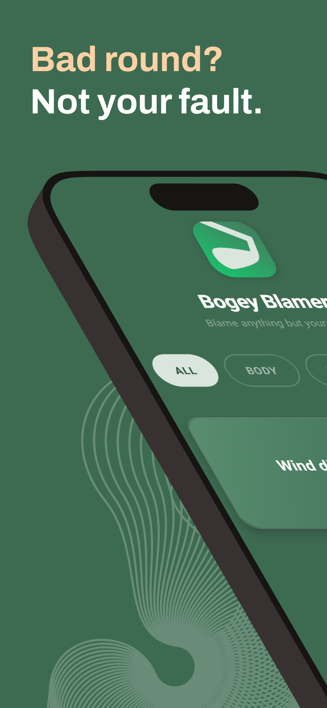
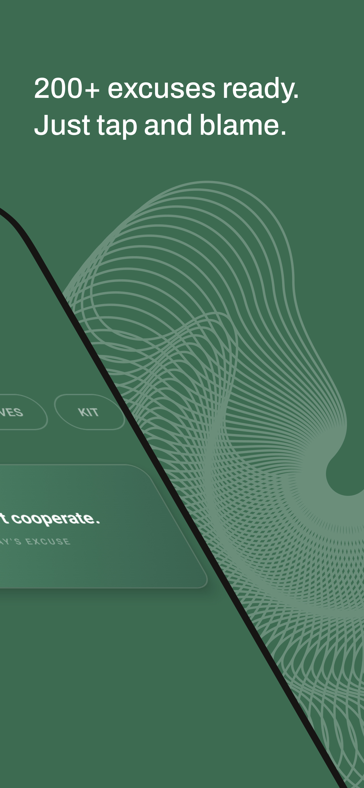
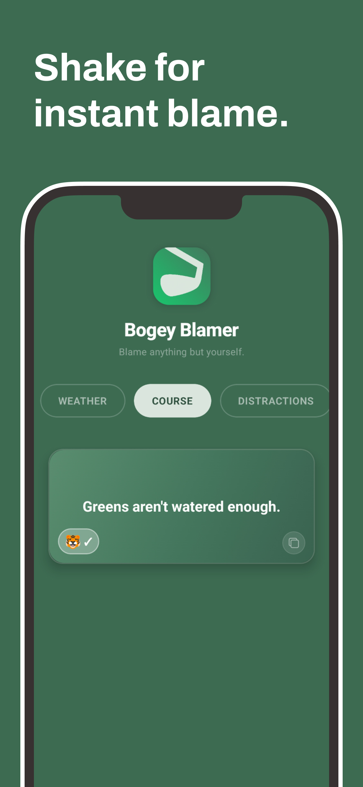
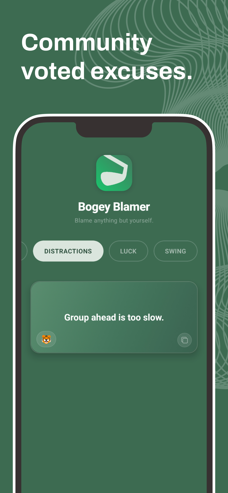
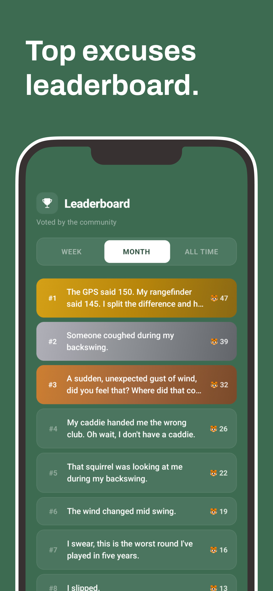
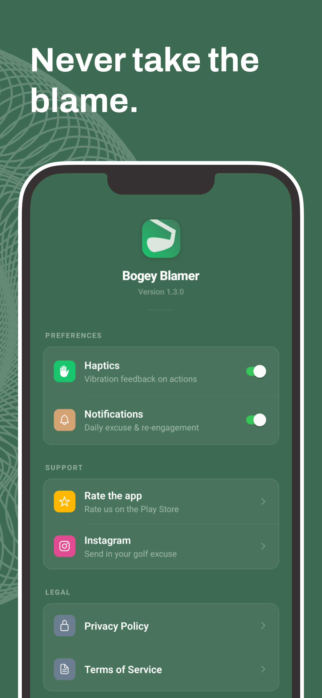

<p align="center">
  
</p>

<h1 align="center">Excuse Caddie</h1>

<p align="center">
  <strong>Bad shot? Blame everything but yourself.</strong><br/>
  A golf excuse generator built with React Native.
</p>

<p align="center">
  
  &nbsp;
  
  &nbsp;
  
</p>

---

## Screenshots

<p align="center">
  
  
  
  
  
  
</p>

---

## What It Does

Tap or shake your phone to generate a random golf excuse. Copy it, share it, blame anything but your swing.

- **219 excuses** across 7 categories (Weather, Equipment, Course, Body, Mental, Blame, Luck)
- **Shake to generate** — just shake your phone for a new excuse
- **Copy & share** — one tap to clipboard
- **Community leaderboard** — vote on the best excuses, see weekly/monthly/all-time rankings
- **Submit your own** — send excuses for community review
- **Haptic feedback** — satisfying vibrations on every action
- **Privacy-first analytics** — TelemetryDeck, no personal data collected
- **In-app updates** — always the latest excuses via Expo Updates
- **100% offline capable** — works without internet, syncs when connected

---

## Tech Stack

| Layer | Technology |
|-------|-----------|
| Framework | React Native + Expo SDK 54 |
| Language | JavaScript |
| Backend | Supabase (leaderboard, votes, submissions) |
| Storage | AsyncStorage |
| Haptics | Expo Haptics |
| Sensors | Expo Sensors (shake detection) |
| Analytics | TelemetryDeck (privacy-first) |
| Testing | Jest |

---

## Getting Started

```bash
git clone https://github.com/dotsystemsdevs/app-golfexcuse.git
cd app-golfexcuse
npm install
npm start
```

```bash
npm run android    # Android emulator
npm run ios        # iOS simulator
npm run web        # Browser
```

**Requirements:** Node.js 18+, Expo CLI

---

## Project Structure

```
App.js              Main single-file app component
src/
  constants.js      Config, palette, spacing, fonts
  excuses.js        219 excuses with categories & tags
  utils.js          pickRandom, pickWeighted helpers
  supabase.js       Supabase client & API helpers
assets/             Icons, logo, splash screen
screenshots/        App Store & Play Store screenshots
backend/            Supabase schema & setup
```

---

## Privacy & Data

**No accounts. No tracking. No ads.**

Anonymous usage analytics via [TelemetryDeck](https://telemetrydeck.com) — no personal data collected. Leaderboard votes use anonymous device IDs.

---

## Legal

- [Privacy Policy](https://dotsystemsdevs.github.io/app-legal-docs/app-golfexcuse/privacy.html)
- [Terms of Service](https://dotsystemsdevs.github.io/app-legal-docs/app-golfexcuse/terms.html)

## License

MIT
